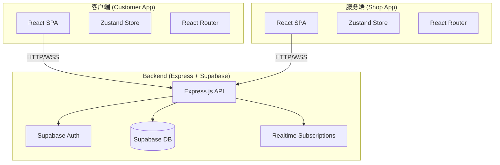
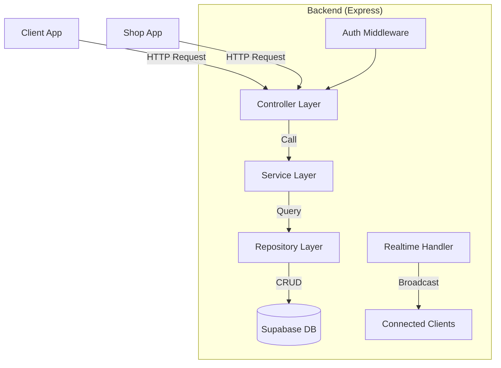
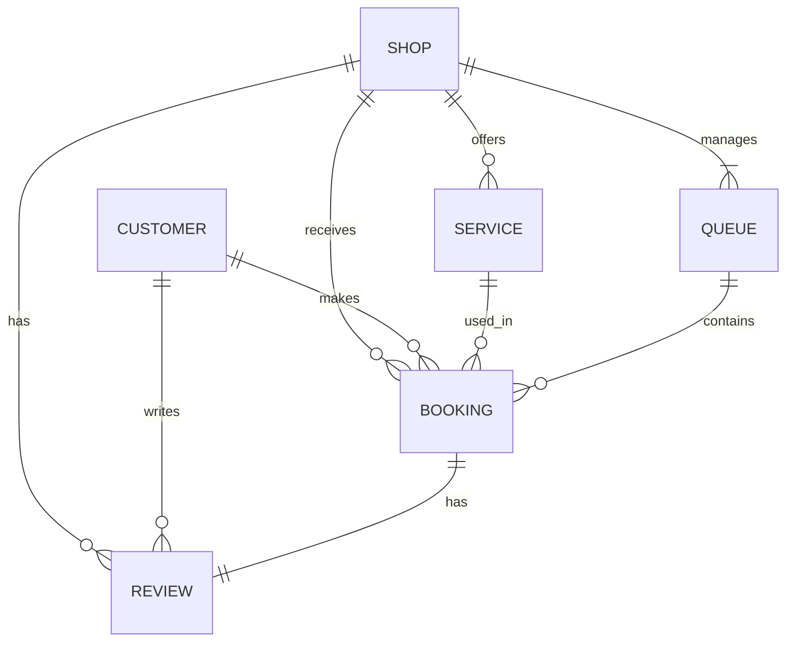

## 1. Architecture Design



## 2. Technology Description

- **前端（客户端+服务端）**：React@18 + TypeScript + tailwindcss@3 + vite
- **初始化工具**：vite-init
- **后端**：Express@4 + TypeScript
- **数据库**：Supabase (PostgreSQL)
- **状态管理**：Zustand
- **路由**：React Router DOM
- **图标库**：Lucide React
- **实时通信**：Supabase Realtime
- **其他**：Day.js（日期处理）、Recharts（数据可视化）

## 3. Route Definitions

### 客户端 (Customer App) Routes
| Route | Purpose |
|-------|---------|
| /customer | 首页/雷达搜索 |
| /customer/shop/:id | 店铺详情 |
| /customer/booking/:shopId | 预约页面 |
| /customer/queue/:queueId | 排队状态 |
| /customer/profile | 个人中心 |
| /customer/login | 登录页 |

### 服务端 (Shop App) Routes
| Route | Purpose |
|-------|---------|
| /shop | 仪表盘首页 |
| /shop/manage | 店铺管理 |
| /shop/bookings | 预约管理 |
| /shop/reviews | 评价管理 |
| /shop/analytics | 数据统计 |
| /shop/login | 登录页 |

### 后端 API Routes
| Route | Method | Purpose |
|-------|--------|---------|
| /api/shops | GET | 获取店铺列表 |
| /api/shops/:id | GET | 获取店铺详情 |
| /api/shops | POST | 创建店铺（服务端） |
| /api/shops/:id | PUT | 更新店铺信息 |
| /api/bookings | POST | 创建预约 |
| /api/bookings/:id | PUT | 更新预约状态 |
| /api/queues | GET | 获取排队队列 |
| /api/queues/:id | PUT | 更新排队状态 |
| /api/reviews | POST | 提交评价 |

## 4. API Definitions

### Type Definitions

```typescript
// 店铺信息
interface Shop {
  id: string;
  name: string;
  description: string;
  address: string;
  latitude: number;
  longitude: number;
  phone: string;
  images: string[];
  services: Service[];
  openingHours: OpeningHours;
  rating: number;
  reviewCount: number;
  level: 'excellent' | 'good' | 'average' | 'poor';
  isActive: boolean;
  createdAt: Date;
  updatedAt: Date;
}

// 服务项目
interface Service {
  id: string;
  name: string;
  price: number;
  duration: number; // 分钟
  description?: string;
}

// 营业时间
interface OpeningHours {
  [key: string]: { open: string; close: string; isOpen: boolean };
}

// 用户（顾客）
interface Customer {
  id: string;
  name: string;
  phone: string;
  avatar?: string;
}

// 预约
interface Booking {
  id: string;
  shopId: string;
  customerId: string;
  serviceId: string;
  barberId?: string;
  scheduledTime: Date;
  status: 'pending' | 'confirmed' | 'completed' | 'cancelled';
  notes?: string;
  queueNumber?: number;
}

// 排队
interface Queue {
  id: string;
  shopId: string;
  bookings: Booking[];
  currentNumber: number;
  estimatedWaitTime: number; // 分钟
}

// 评价
interface Review {
  id: string;
  shopId: string;
  customerId: string;
  bookingId: string;
  serviceScore: number;
  priceScore: number;
  skillScore: number;
  overallScore: number;
  comment: string;
  createdAt: Date;
}

// 提醒设置
interface Reminder {
  id: string;
  bookingId: string;
  minutesBefore: number;
  sound: string;
  isEnabled: boolean;
}
```

## 5. Server Architecture Diagram



## 6. Data Model

### 6.1 Data Model Definition



### 6.2 Data Definition Language

```sql
-- 店铺表
CREATE TABLE shops (
  id UUID PRIMARY KEY DEFAULT gen_random_uuid(),
  name VARCHAR(255) NOT NULL,
  description TEXT,
  address VARCHAR(255) NOT NULL,
  latitude DECIMAL(10, 8) NOT NULL,
  longitude DECIMAL(11, 8) NOT NULL,
  phone VARCHAR(20),
  images TEXT[] DEFAULT '{}',
  opening_hours JSONB NOT NULL,
  rating DECIMAL(3, 2) DEFAULT 0,
  review_count INTEGER DEFAULT 0,
  level VARCHAR(20) DEFAULT 'average',
  is_active BOOLEAN DEFAULT true,
  created_at TIMESTAMPTZ DEFAULT NOW(),
  updated_at TIMESTAMPTZ DEFAULT NOW()
);

-- 服务项目表
CREATE TABLE services (
  id UUID PRIMARY KEY DEFAULT gen_random_uuid(),
  shop_id UUID REFERENCES shops(id) ON DELETE CASCADE,
  name VARCHAR(255) NOT NULL,
  price DECIMAL(10, 2) NOT NULL,
  duration INTEGER NOT NULL,
  description TEXT,
  created_at TIMESTAMPTZ DEFAULT NOW()
);

-- 顾客表
CREATE TABLE customers (
  id UUID PRIMARY KEY DEFAULT gen_random_uuid(),
  name VARCHAR(255) NOT NULL,
  phone VARCHAR(20) UNIQUE NOT NULL,
  avatar TEXT,
  created_at TIMESTAMPTZ DEFAULT NOW()
);

-- 预约表
CREATE TABLE bookings (
  id UUID PRIMARY KEY DEFAULT gen_random_uuid(),
  shop_id UUID REFERENCES shops(id) ON DELETE CASCADE,
  customer_id UUID REFERENCES customers(id) ON DELETE CASCADE,
  service_id UUID REFERENCES services(id),
  barber_name VARCHAR(255),
  scheduled_time TIMESTAMPTZ NOT NULL,
  status VARCHAR(20) DEFAULT 'pending',
  notes TEXT,
  queue_number INTEGER,
  created_at TIMESTAMPTZ DEFAULT NOW(),
  updated_at TIMESTAMPTZ DEFAULT NOW()
);

-- 排队队列表
CREATE TABLE queues (
  id UUID PRIMARY KEY DEFAULT gen_random_uuid(),
  shop_id UUID REFERENCES shops(id) ON DELETE CASCADE,
  current_number INTEGER DEFAULT 1,
  estimated_wait_time INTEGER DEFAULT 15,
  created_at TIMESTAMPTZ DEFAULT NOW(),
  updated_at TIMESTAMPTZ DEFAULT NOW()
);

-- 评价表
CREATE TABLE reviews (
  id UUID PRIMARY KEY DEFAULT gen_random_uuid(),
  shop_id UUID REFERENCES shops(id) ON DELETE CASCADE,
  customer_id UUID REFERENCES customers(id) ON DELETE CASCADE,
  booking_id UUID REFERENCES bookings(id) ON DELETE CASCADE,
  service_score INTEGER NOT NULL CHECK (service_score >= 1 AND service_score <= 5),
  price_score INTEGER NOT NULL CHECK (price_score >= 1 AND price_score <= 5),
  skill_score INTEGER NOT NULL CHECK (skill_score >= 1 AND skill_score <= 5),
  overall_score DECIMAL(3, 2) NOT NULL,
  comment TEXT,
  created_at TIMESTAMPTZ DEFAULT NOW()
);

-- 提醒设置表
CREATE TABLE reminders (
  id UUID PRIMARY KEY DEFAULT gen_random_uuid(),
  booking_id UUID REFERENCES bookings(id) ON DELETE CASCADE,
  minutes_before INTEGER NOT NULL DEFAULT 15,
  sound VARCHAR(50) NOT NULL DEFAULT 'chime',
  is_enabled BOOLEAN DEFAULT true,
  created_at TIMESTAMPTZ DEFAULT NOW()
);

-- 索引
CREATE INDEX idx_shops_location ON shops USING GIST (
  ST_SetSRID(ST_MakePoint(longitude, latitude), 4326)
);
CREATE INDEX idx_bookings_shop_time ON bookings(shop_id, scheduled_time);
CREATE INDEX idx_reviews_shop ON reviews(shop_id);

-- 启用行级安全
ALTER TABLE shops ENABLE ROW LEVEL SECURITY;
ALTER TABLE services ENABLE ROW LEVEL SECURITY;
ALTER TABLE customers ENABLE ROW LEVEL SECURITY;
ALTER TABLE bookings ENABLE ROW LEVEL SECURITY;
ALTER TABLE queues ENABLE ROW LEVEL SECURITY;
ALTER TABLE reviews ENABLE ROW LEVEL SECURITY;

-- RLS策略示例
CREATE POLICY "Shops are viewable by everyone" ON shops
  FOR SELECT USING (true);

CREATE POLICY "Shops can update their own data" ON shops
  FOR ALL USING (auth.uid() = id);
```
