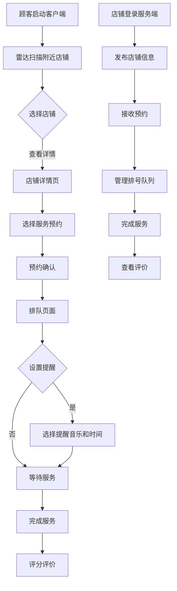

## 1. Product Overview

这是一个理发店在线预约系统，包含客户端和服务端两个独立应用，实现实时预约、排号、距离计算和个性化提醒功能。
- 目标用户：理发店（服务端）和顾客（客户端）
- 解决问题：理发店预约管理混乱、顾客排队等待时间过长、店铺信息不透明

## 2. Core Features

### 2.1 User Roles

| Role | Registration Method | Core Permissions |
|------|---------------------|------------------|
| 顾客 | 手机号注册 | 搜索附近店铺、预约服务、查看排队、设置提醒、评价店铺 |
| 理发店 | 手机号/邮箱注册 | 发布店铺信息、管理预约、排号队列、查看顾客评价、统计数据 |

### 2.2 Feature Module

**客户端（顾客端）：**
1. **首页/雷达搜索页**：雷达动画显示附近理发店、店铺列表、筛选排序
2. **店铺详情页**：店铺信息、服务项目、价格、评价、预约按钮
3. **预约页**：选择服务、理发师、时间，确认预约
4. **排队/排号页**：实时排队状态、预计等待时间、距离计算、提醒设置
5. **个人中心**：我的预约、我的评价、账户设置
6. **登录/注册页**：用户身份验证

**服务端（理发店端）：**
1. **首页/仪表盘**：今日预约统计、排队状态、实时数据
2. **店铺管理页**：编辑店铺信息、发布服务项目、设置营业时间
3. **预约管理页**：查看预约、确认/取消预约、管理排号
4. **评价管理页**：查看顾客评价、回复评价
5. **数据统计页**：营收统计、客流量、评分趋势
6. **登录/注册页**：店铺身份验证

### 2.3 Page Details

| Page Name | Module Name | Feature description |
|-----------|-------------|---------------------|
| 客户端首页 | 雷达搜索 | 3D雷达动画扫描附近店铺、按距离和等级显示、点击查看详情 |
| 店铺详情页 | 店铺信息 | 显示店铺名称、等级、评分、地址、服务项目、价格表、顾客评价 |
| 预约页 | 预约功能 | 选择服务、理发师、时间段，确认预约，生成预约码 |
| 排号页 | 排队状态 | 显示当前排队人数、预计等待时间、步行到达时间、设置提醒时间和音乐 |
| 个人中心 | 我的预约 | 查看历史/未来预约、取消预约、查看预约详情 |
| 服务端首页 | 仪表盘 | 统计卡片（今日预约、客流量、营收）、排队队列实时更新 |
| 店铺管理页 | 信息编辑 | 上传店铺照片、编辑服务项目、设置价格、更新营业时间 |
| 预约管理页 | 预约列表 | 查看所有预约、确认/完成/取消预约、调整排队顺序 |

## 3. Core Process

### 顾客端流程
1. 用户打开客户端应用
2. 雷达扫描显示附近理发店
3. 用户选择店铺查看详情
4. 用户选择服务并预约时间
5. 用户可查看排队状态和等待时间
6. 系统根据距离计算到达时间
7. 用户设置提醒（音乐/音效选择）
8. 用户到达并完成服务
9. 用户对店铺进行评分和评价

### 理发店端流程
1. 店铺登录服务端应用
2. 发布店铺信息和服务项目
3. 接收并管理顾客预约
4. 更新排号队列状态
5. 完成服务并标记
6. 查看顾客评价
7. 分析统计数据

## 4. User Interface Design

### 4.1 Design Style
- **主色调**：深蓝（#1e40af）和暖橙色（#f97316），代表专业和温暖
- **辅助色**：浅灰（#f1f5f9）、深灰（#334155）
- **按钮风格**：圆角矩形，带有微妙阴影和悬停动画
- **字体**：Inter 为主标题，Roboto 为正文
- **布局风格**：卡片式布局，清晰的信息层级
- **图标风格**：使用 Lucide React 图标库，简约线性风格

### 4.2 Page Design Overview

| Page Name | Module Name | UI Elements |
|-----------|-------------|-------------|
| 客户端首页 | 雷达搜索 | 圆形雷达背景、脉冲动画、店铺图标、列表卡片、筛选按钮 |
| 店铺详情页 | 店铺信息 | 顶部大图轮播、信息卡片、服务列表、评分展示、评价瀑布流 |
| 排号页 | 排队状态 | 进度条、倒计时、地图预览、音乐选择器、滑块控件 |
| 服务端首页 | 仪表盘 | 渐变统计卡片、实时队列列表、图表可视化、操作按钮 |
| 店铺管理页 | 信息编辑 | 分栏布局、表单控件、图片上传、实时预览 |

### 4.3 Responsiveness
- 移动优先设计，适配手机、平板
- 客户端和服务端均为响应式布局
- 触摸优化，大点击区域

### 4.4 视觉特效
- 雷达扫描动画（客户端首页）
- 排队进度条动画
- 卡片悬停效果
- 平滑过渡和页面切换
- 音乐播放预览效果
